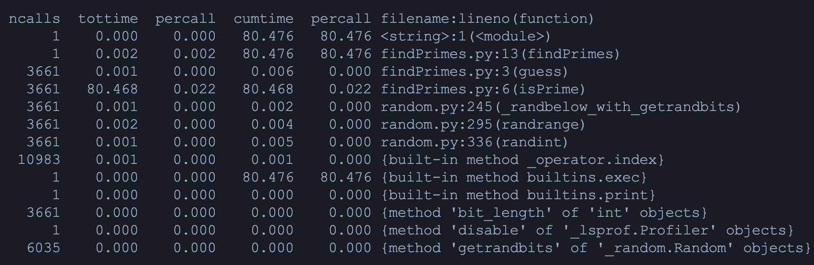
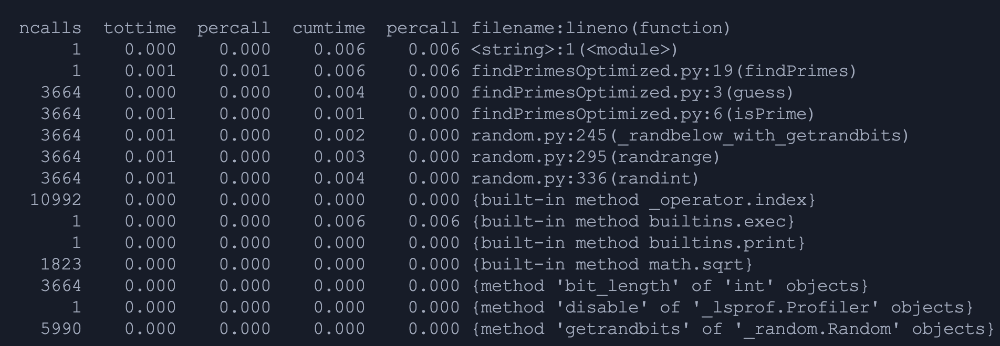

# Module 7: Assignment 01 - Project 07
## Adam LaCasse

### cProfile output from initial code

We can see here that `isPrime` dominates the run (3661 calls, 80.468 s of the total 80.476 s). The double nested loop makes it O(n²) for each candidate.

After refactoring the `isPrime` function to this...
```python
import math

def isPrime(x):
    if x < 2:
        return False
    if x == 2:
        return True
    if x % 2 == 0:
        return False
    limit = int(math.sqrt(x)) + 1
    for i in range(3, limit, 2):
        if x % i == 0:
            return False
    return True
```
We see a significant improvement!

### cProfile output from optimized code

Replaced the nested loops with an early-exit divisor test up to `sqrt(x)` and skipped even numbers. That cut the cost to roughly O(√n) per call.
